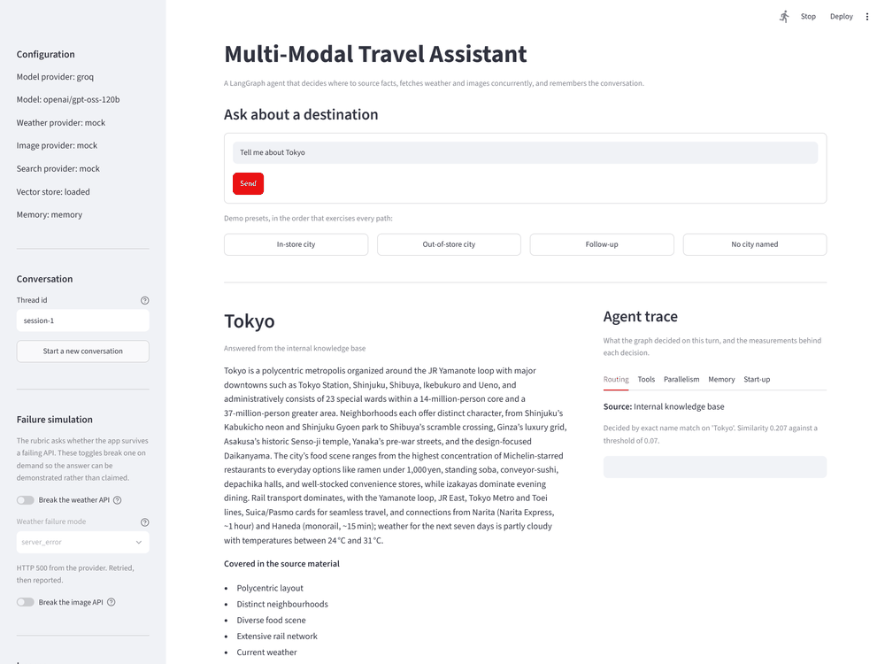
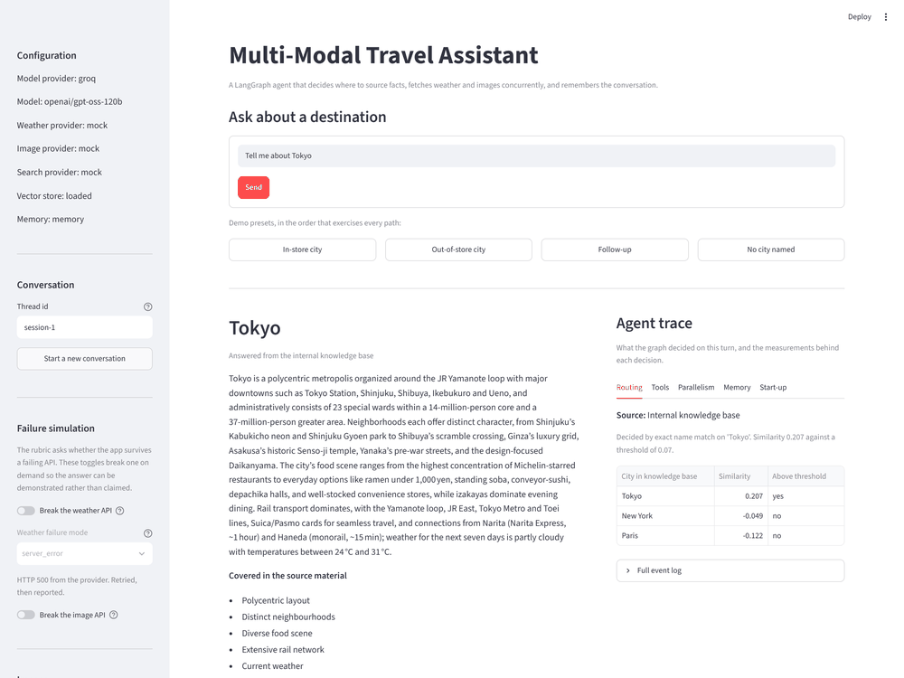
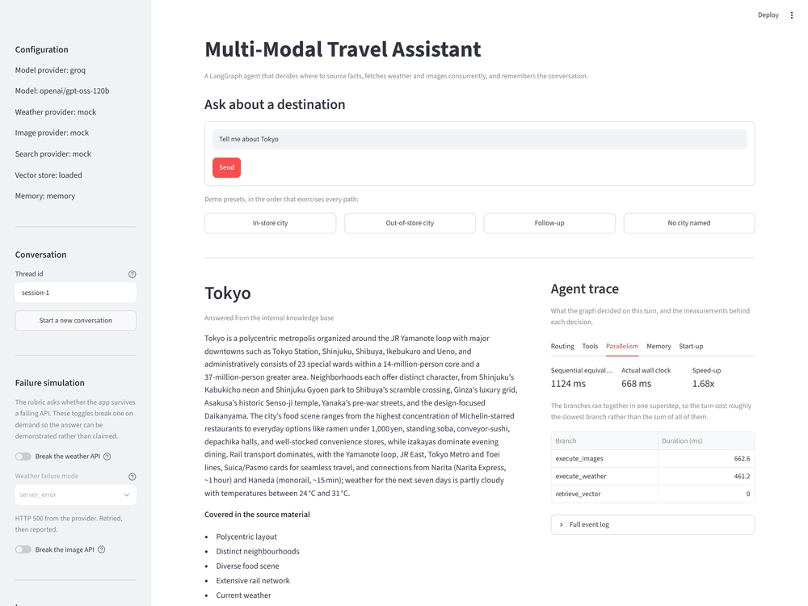
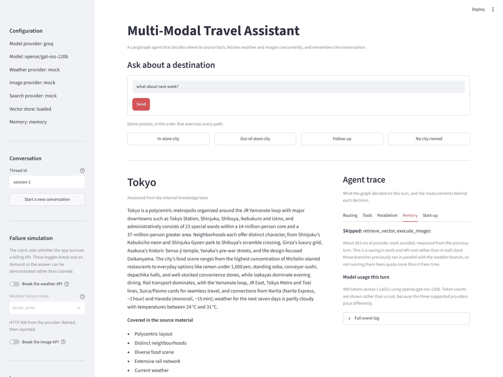
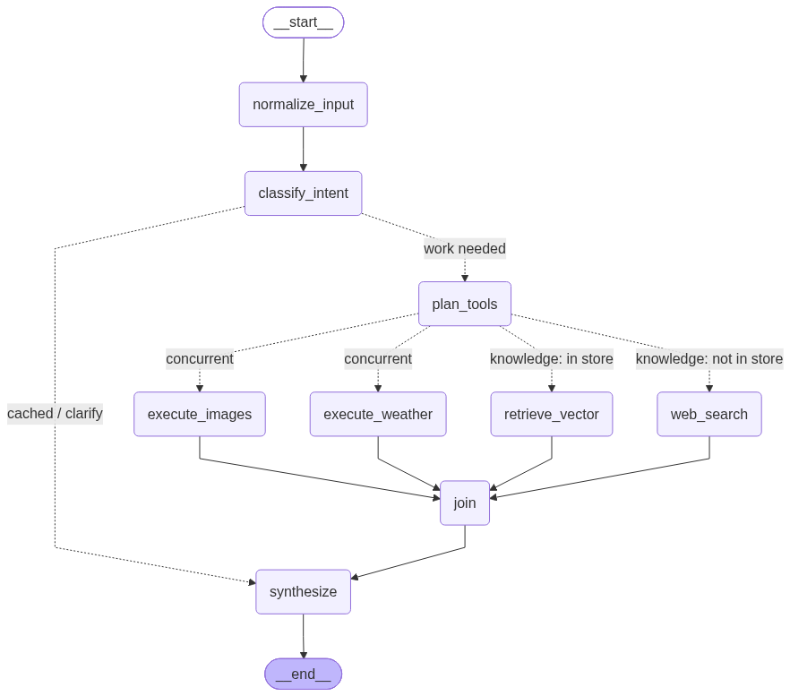

# Multi-Modal Travel Assistant

A LangGraph agent that answers questions about a city with a written summary, a
photo gallery and a weather chart. It decides for itself whether the facts should
come from its own knowledge base or from a live web search, fetches weather and
images concurrently rather than one after the other, and remembers the
conversation so a follow-up like "what about next week?" refreshes only the
forecast. Every external service sits behind an interface with a live and a mock
implementation, so **the whole application runs end to end with no API keys at
all**.

```bash
conda env create -f environment.yml && conda activate travel-agent
python scripts/seed_vectorstore.py
streamlit run src/travel_agent/ui/app.py
```

Full setup, including the Windows variants, is in [RUN_COMMANDS.md](RUN_COMMANDS.md).
The reasoning behind every decision is in [ENGINEERING_JOURNAL.md](ENGINEERING_JOURNAL.md).

---

## The interface



The right-hand **agent trace** panel is the important part: it shows what the
graph decided and the measurements behind each decision, so the internal
behaviour is visible rather than described.

| | |
|---|---|
|  |  |
| **Routing** - the score, the threshold, and every city's similarity | **Parallelism** - sequential-equivalent against actual wall clock |
|  |  |
| **Memory** - which branches a follow-up skipped, and what that saved | **Degradation** - the weather API broken on demand; the page survives |

---

## The graph



Generated from the compiled graph by `scripts/export_graph.py` and committed, so
it is present in a clone regardless of network access. Dashed edges are
conditional; the labels distinguish the two that are *alternatives* from the two
that run *concurrently*.

| Node | What it does |
|---|---|
| `normalize_input` | Cleans the query and starts a fresh turn, clearing per-turn trace and timing keys. |
| `classify_intent` | Resolves the city and date slots deterministically and classifies the turn as `new_city`, `weather_only`, `refine` or `clarify`. |
| `plan_tools` | Decides the knowledge source, then asks the model which tools to call, offering only the tools that suit that route. |
| `retrieve_vector` | Reads the seeded corpus. An internal database read, not a tool call. |
| `web_search` | Runs the web search tool for a city the knowledge base does not cover. |
| `execute_weather` | Manual tool executor, handling the weather call. |
| `execute_images` | Manual tool executor, handling the image call. |
| `join` | Barrier after the fan-out; measures the parallel speed-up. |
| `synthesize` | Produces the validated `TravelResponse` the UI renders. |

**Conditional edge 1 - `route_after_intent`.** Decides whether the turn needs work
at all. A turn with no resolvable city, or one whose answer is already in state,
goes straight to `synthesize`.

**Conditional edge 2 - `route_and_fan_out`.** Does both jobs the assignment asks
for. It chooses the knowledge branch (`retrieve_vector` **or** `web_search`) and
returns a **list** of node names, which schedules the knowledge branch, the
weather branch and the image branch into a single superstep so they execute
concurrently.

---

## How each requirement is met

| Requirement | Where | Notes |
|---|---|---|
| LangGraph orchestration, clear nodes/edges/state | [`graph/builder.py`](src/travel_agent/graph/builder.py), [`graph/edges.py`](src/travel_agent/graph/edges.py) | 9 nodes, 2 conditional edges. |
| Typed state | [`schemas/state.py`](src/travel_agent/schemas/state.py) | `TypedDict` with `Annotated` reducers on every concurrently-written key. |
| Streamlit GUI | [`ui/app.py`](src/travel_agent/ui/app.py), [`ui/components/`](src/travel_agent/ui/components/) | Summary, gallery, Plotly chart, agent trace. |
| OpenAI or Anthropic model | [`services/llm/openai.py`](src/travel_agent/services/llm/openai.py), [`services/llm/anthropic.py`](src/travel_agent/services/llm/anthropic.py) | Both implemented; see "Why Groq is the default" below. |
| Vector store seeded with 3 cities | [`data/city_facts/`](data/city_facts/), [`scripts/seed_vectorstore.py`](scripts/seed_vectorstore.py) | Paris, Tokyo, New York - 27 chunks, 9 each. FAISS with an automatic NumPy fallback. |
| Web search for cities not in the store | [`tools/search/`](src/travel_agent/tools/search/) | Mock, DuckDuckGo and Tavily implementations. |
| **Conditional edge routing on knowledge availability** | [`services/router.py`](src/travel_agent/services/router.py) | Gazetteer first, then centroid similarity against a calibrated threshold. |
| Structured output object | [`schemas/response.py`](src/travel_agent/schemas/response.py) | `TravelResponse` carries `city_summary`, `weather_forecast`, `image_urls`. |
| UI parses that object to draw a line chart | [`ui/components/charts.py`](src/travel_agent/ui/components/charts.py) | Plotly, seven daily points with a shaded high/low band. |
| Weather forecast, 5-7 days | [`tools/weather/`](src/travel_agent/tools/weather/) | Climate-plausible mock; OpenWeatherMap live. |
| Image retrieval | [`tools/images/`](src/travel_agent/tools/images/) | Verified Wikimedia photographs; Unsplash live. |
| Graceful error handling | [`tools/registry.py`](src/travel_agent/tools/registry.py), [`tools/retry.py`](src/travel_agent/tools/retry.py) | Timeouts, bounded retries, and a failing tool never breaks the page. |
| `graph.png` | [`graph.png`](graph.png), [`scripts/export_graph.py`](scripts/export_graph.py) | Generated and committed. |

**327 tests, all passing with no API keys configured.**

```bash
pytest -q     # 327 passed
```

---

## The three distinctions, with measured evidence

### 1. Manual tool execution

[`graph/nodes/tool_executor.py`](src/travel_agent/graph/nodes/tool_executor.py)
reads `state["messages"][-1].tool_calls` directly. For each call it resolves the
name in the registry, validates the arguments against that tool's Pydantic
schema, dispatches it, and returns a `ToolMessage` carrying the matching
`tool_call_id`. Calls run under `asyncio.gather` so one failing tool never aborts
its siblings.

Failures come back as `ToolMessage(status="error")` with a useful body - an
unknown tool name is answered with the list of tools that *do* exist, so the model
can correct itself. The module opens with a plain-English explanation of the raw
protocol and what breaks if the id pairing is wrong.

**No prebuilt helpers, and that is enforced rather than promised.**
`test_no_prebuilt_tool_calling_helpers_anywhere_in_the_source` walks every file in
`src/` and `scripts/`, checking imports via the AST and identifiers via the
tokeniser, and fails if `ToolNode`, `create_tool_calling_agent` or
`create_react_agent` appear in code. It ignores comments and strings, so the
module can discuss the decision it made without breaking the check that enforces
it.

### 2. Parallel fan-out

A conditional edge returns a *list* of node names, so the knowledge, weather and
image branches are scheduled into one superstep and run concurrently. This is a
property of the topology, not a `gather` hidden inside a node - which is why it is
visible in `graph.png`.

| Query | Route | Sequential-equivalent | Actual wall clock | Speed-up |
|---|---|---|---|---|
| Tell me about Tokyo | vector store | 1964 ms | 1157 ms | 1.70x |
| Tell me about Paris | vector store | 2056 ms | 1276 ms | 1.61x |
| Tell me about Kyoto | web search | 2865 ms | 1035 ms | 2.77x |

**Mean 2.03x**, about 1.1 seconds saved per request. Repeated runs give a mean
between roughly 1.9x and 2.1x - the mocks apply latency jitter, so the shape is
stable but the exact figure is not.

**What bounds it:** concurrent work costs the slowest branch, not the sum. On the
vector-store path the local index read is effectively free, so the fan-out is
really weather against images and the ceiling is the slower of the two. The web
path gains most because it has three genuinely slow branches.

### 3. Checkpointer and follow-up partial update

`MemorySaver` by default, `AsyncSqliteSaver` when `CHECKPOINTER=sqlite`, scoped by
`thread_id`. Ask about Tokyo, then ask "what about next week?": the city is
resolved from checkpointed state, the date window moves, and **only the weather
branch runs**.

```
TURN 1  "Tell me about Tokyo"      intent=new_city
        ran: classify_intent, plan_tools, retrieve_vector,
             execute_weather, execute_images, synthesize

TURN 2  "what about next week?"    intent=weather_only
        ran     : classify_intent, plan_tools, execute_weather, synthesize
        skipped : retrieve_vector, execute_images
        forecast: 2026-08-19 -> 2026-08-26   (the window actually moved)
        images  : preserved from turn 1, not re-fetched
```

**What that actually saves, stated honestly:** measured over three turn-pairs, a
mean of **296 ms** off the wall clock but **1184 ms** of provider work avoided.
Those diverge because the skipped branches previously ran *concurrently* with the
weather branch, so removing them barely shortens the turn. The real saving is an
image round-trip and a knowledge read that would have been discarded, plus the
quota they cost. **Parallelism buys latency; skipping buys cost** - and the second
is the one that scales.

The skip is auditable, not asserted: `timings` is cleared each turn, so its keys
are a record of what actually executed, and a test asserts `execute_images` is
absent on turn two. A re-run-and-discard implementation would fail it.

---

## Architecture decisions

| Decision | Why | Trade-off accepted |
|---|---|---|
| LangGraph over a chain | Conditional routing, a fan-out and a partial re-run are topology, not control flow. A chain hides all three inside application code. | More machinery, and every concurrently-written state key needs a reducer. |
| Layered router: gazetteer, then similarity | Whether the store covers a city is usually a question about *names*, and a lookup answers it exactly. "NYC" would fail a similarity threshold outright. | The gazetteer needs maintenance as the corpus grows; the similarity path is what generalises. |
| Threshold 0.07 | Measured, not guessed: seeded cities score 0.102-0.207, unseeded 0.000-0.040, so 0.07 sits inside a 0.062 gap. The seeder prints the matrix. | The value is corpus-specific and must be re-derived if the corpus changes. A start-up guard warns if it drifts out of range. |
| Hashed TF-IDF embeddings by default | The retrieval question is lexical - does this name one of three cities - and the alternative costs hundreds of megabytes of PyTorch or an API key. | It does not know "the French capital" means Paris. `EMBEDDING_PROVIDER=openai` swaps in semantic embeddings. |
| FAISS with a NumPy fallback | FAISS is the right shape for a corpus that grows; a native wheel that fails to install must not stop the app. | Two backends to keep behind one interface. Tested both ways. |
| JSON mode + validate-and-repair, not `with_structured_output` | Works identically across all four drivers, and keeps failure handling in code I can explain. | One extra model call in the rare repair case. |
| Model writes prose only | The forecast and image URLs are typed tool payloads; asking a model to echo them back only creates a chance to alter them. | The summary cannot reference exact numbers the tools did not provide. |
| Mocks as the default | The assignment blesses them, and a demo depending on a reviewer's API keys is a demo that fails in the room. | Mocks can be more obedient than reality - see below. |

### Why Groq is the default model

**OpenAI and Anthropic are both fully implemented**, behind the same interface and
covered by the same tests. Switching is one line in `.env`:

```bash
LLM_PROVIDER=anthropic     # or openai, or groq, or mock
```

Groq is the default demo driver for practical reasons rather than architectural
ones. The free-tier allowance on the spec-named providers does not comfortably
cover a day of iterative development plus a live demo, and a demo that dies on a
quota error is worse than any design nicety. Groq's API is also OpenAI-compatible
and returns a genuine `tool_calls` payload, so the manual executor is exercised
against the real wire protocol; and it is fast enough that the parallel
measurement is dominated by tool latency rather than model latency, which makes
that number cleaner.

With no keys at all the deterministic `MockLLM` takes over. It is not a stub - it
emits real `tool_calls` payloads with unique ids, so every downstream code path is
the one a live model exercises.

### The most useful thing this project taught me

The suite reached 293 passing tests before the first live request. That request
returned a page with **no images**: the live model, offered both tools, called
only the weather tool. No test could have caught it, because my mock always
requested both. **Mocks verify your code against your assumptions, not against
reality.**

Strengthening the prompt did not fix it, and would have been the wrong fix anyway
- it makes a hard contract depend on persuasion. The interface needs a summary, a
gallery and a chart, so the required tool set is known before the model is asked
anything, and the graph now completes any plan that omits one, recorded in the
trace as `tools_added_by_graph`. The planner became advisory for tool *selection*
rather than authoritative - correct when the required set is known in advance,
wrong if the tool set were open-ended.

`scripts/live_smoke_test.py` runs one live request end to end. It should have
existed on day one rather than at the end.

---

## Sixty-second demo

Type these four in order. Each exercises a different path.

| # | Type this | What to look for |
|---|---|---|
| 1 | `Tell me about Tokyo` | Trace shows **Internal knowledge base**, exact name match, similarity 0.207 against a 0.07 threshold. Gallery, chart and summary render. |
| 2 | `what about next week?` | City carries over from memory. Memory tab shows `retrieve_vector, execute_images` **skipped**. The forecast dates move; the images do not change. |
| 3 | `Tell me about Kyoto` | Trace shows **Live web search** - Kyoto scores 0.040, below the threshold. Summary comes from search results with source links. |
| 4 | Toggle **Break the weather API**, then `Tell me about Paris` | Summary and gallery still render. A banner names the failure. No stack trace. |

Then open the **Parallelism** tab on any answer to see the sequential-equivalent
against the actual wall clock.

---

## Project layout

```
src/travel_agent/
  config/          typed settings; nothing else reads the environment
  schemas/         state with reducers, tool arguments, responses, trace events
  services/        embeddings, vector stores, retrieval, router, LLM drivers
  tools/           weather, images, search - each with a live and a mock provider
  graph/           nodes, edges, builder, checkpointer, diagram export
  ui/              Streamlit app, the async bridge, and the render components
data/
  city_facts/      the seed corpus, one markdown file per city
  images/          bundled offline fallback images + ATTRIBUTION.md
evals/             labelled queries for router accuracy
scripts/           seeding, graph export, smoke tests, screenshots
tests/             327 tests, no API keys required
```

## Running with live providers

Everything defaults to mocks. Each provider switches independently:

```bash
LLM_PROVIDER=groq          GROQ_API_KEY=...
WEATHER_PROVIDER=live      OPENWEATHER_API_KEY=...
IMAGE_PROVIDER=live        UNSPLASH_ACCESS_KEY=...
SEARCH_PROVIDER=live       # DuckDuckGo needs no key; Tavily uses TAVILY_API_KEY
```

Verify a live provider end to end with:

```bash
python scripts/live_smoke_test.py
```

## Attribution

Gallery photographs come from Wikimedia Commons and are credited with their
photographer and licence in [`data/images/ATTRIBUTION.md`](data/images/ATTRIBUTION.md),
read from the Commons API rather than assumed. The bundled `*.png` files in that
directory are generated placeholders used when Commons is unreachable, and carry
no third-party rights.
